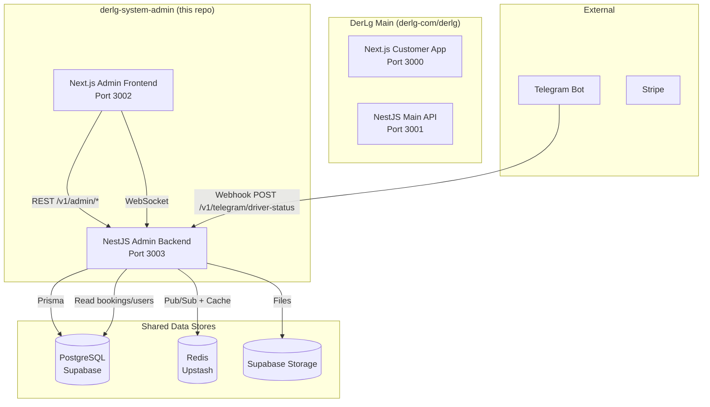
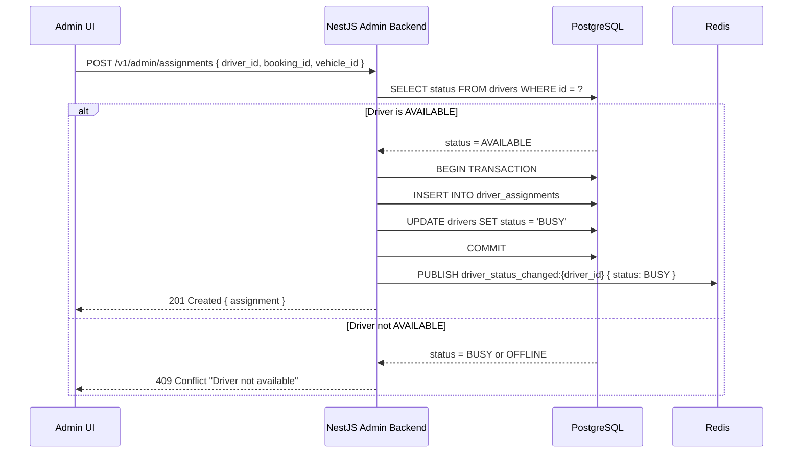
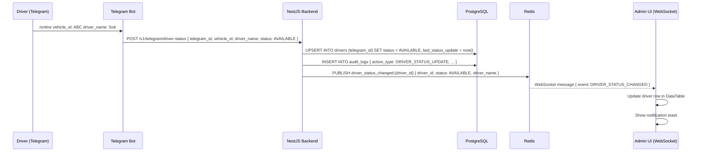
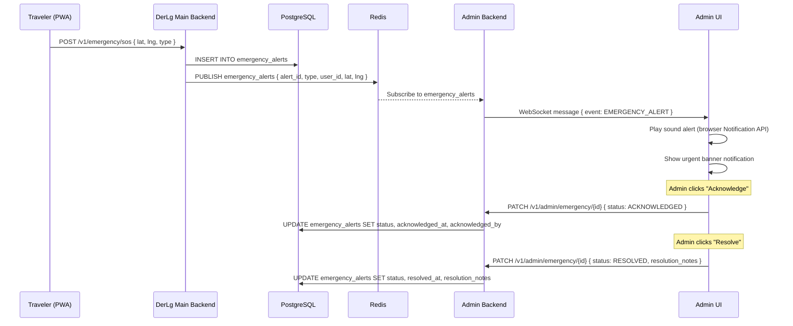
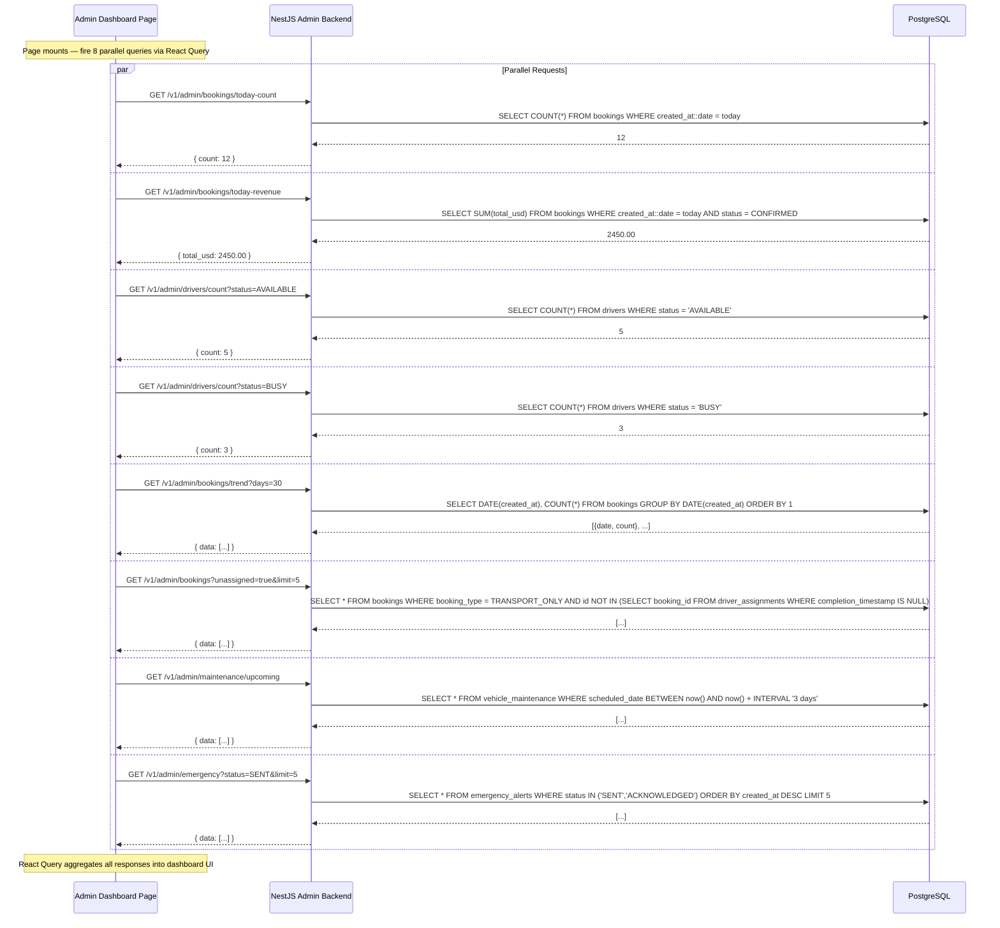
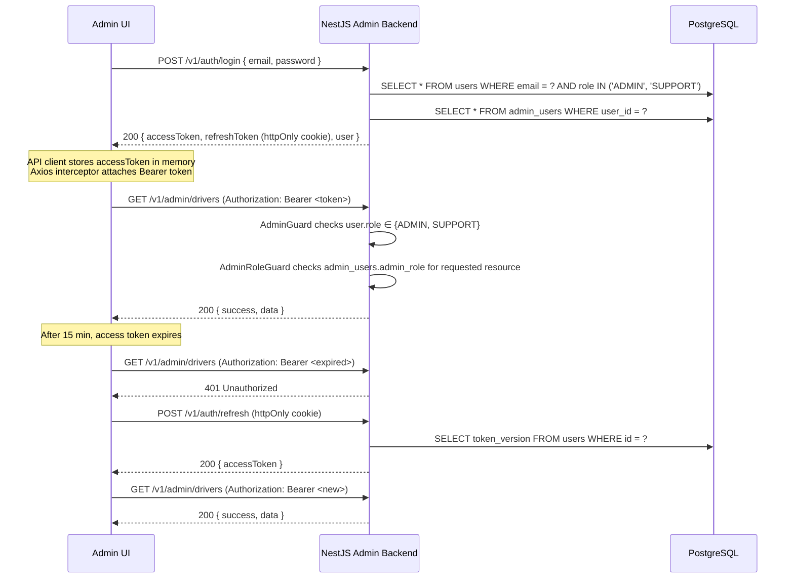
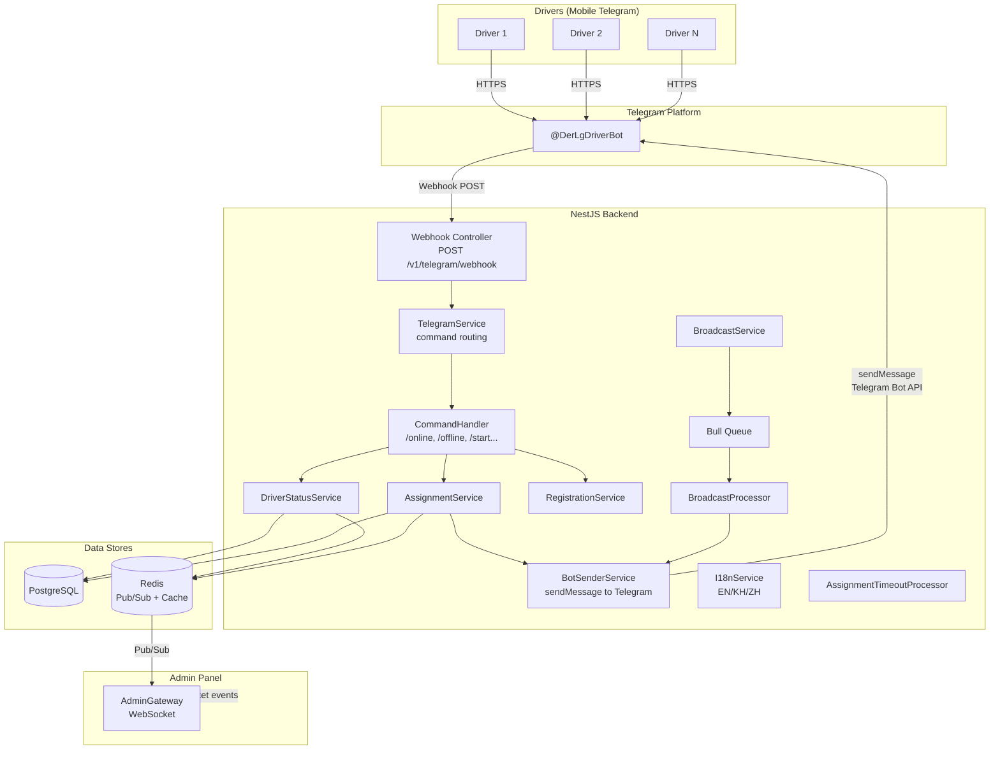
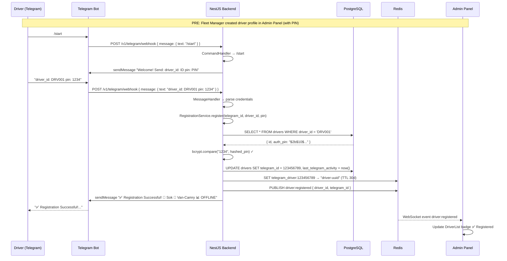
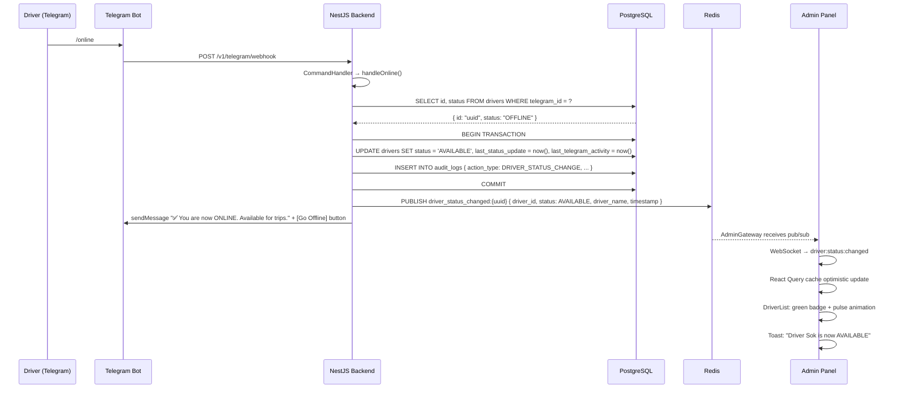
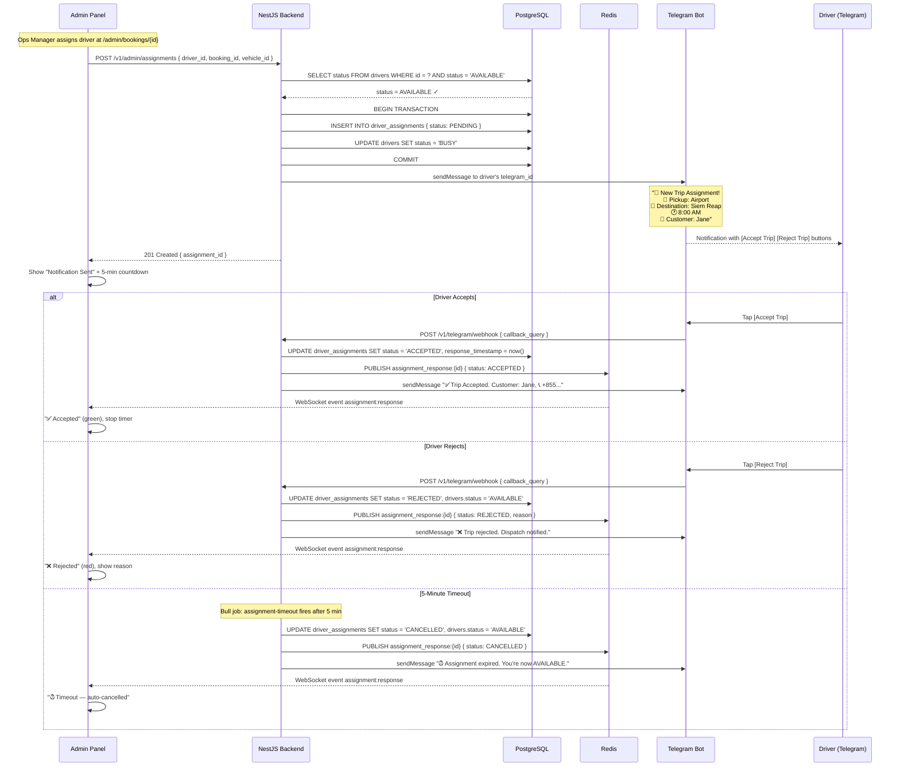

# DerLg System Admin — Architecture Diagrams

> Generated: 2026-05-10

## 1. System Context



## 2. Driver Assignment Flow



## 3. Telegram → Real-Time Status Sync



## 4. Emergency Alert Flow



## 5. Dashboard Composition Pattern



## 6. Admin Auth & Token Refresh



## 7. Telegram Bot System Architecture



## 8. Driver Registration Flow (Telegram)



## 9. Real-Time Driver Status Sync (Telegram → Admin)



## 10. Trip Assignment with Telegram Notification



## 11. Broadcast Messaging Flow

```mermaid
sequenceDiagram
    participant Admin as Admin Panel
    participant BE as NestJS Backend
    participant PG as PostgreSQL
    participant Queue as Bull Queue
    participant Bot as BotSenderService
    participant TG as Telegram API
    participant Driver as Driver (Telegram)

    Admin->>BE: POST /v1/admin/telegram/broadcast { message, target_filter: { type: "online" } }
    BE->>PG: INSERT INTO broadcast_messages { message_id: "BM-001", status: PENDING }
    BE->>PG: SELECT telegram_id FROM drivers WHERE status = 'AVAILABLE' AND telegram_id IS NOT NULL
    PG-->>BE: [123, 456, 789, ...]  (45 drivers)

    BE-->>Admin: 201 { message_id: "BM-001", queued_count: 45 }

    BE->>Queue: Add job "send-broadcast" { message_id, content, telegram_ids }
    Queue->>BE: UPDATE broadcast_messages SET status = 'IN_PROGRESS'

    loop For each driver (rate limited 30/sec)
        Queue->>Bot: sendMessage(telegram_id, "📢 Message from DerLg Dispatch:\n\n{content}")
        Bot->>TG: POST /bot{token}/sendMessage
        TG-->>Bot: OK
        Bot-->>Queue: sent ✓
        Queue->>PG: UPDATE broadcast_messages SET sent_count = sent_count + 1

        Note over Queue: Every 10 messages: PUBLISH Redis broadcast:status
    end

    Queue->>PG: UPDATE broadcast_messages SET status = 'COMPLETED', completed_at = now(), sent_count = 45, failed_count = 0

    Redis-->>Admin: WebSocket broadcast:status (real-time updates)
    Admin->>Admin: Update BroadcastHistory table with sent_count
    Admin->>Admin: Toast: "Broadcast sent to 45 drivers"```